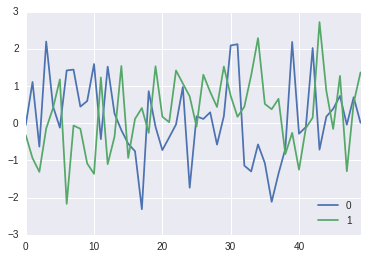

Some examples
=============

.. code:: python

    import numpy as np
    import pandas as pd
    import seaborn as sns
    import matplotlib.pyplot as plt
    %matplotlib inline

Creating a dummy Pandas dataframe
---------------------------------

.. code:: python

    df = pd.DataFrame(np.random.randn(50,2))

How does the dataframe display render?
--------------------------------------

.. code:: python

    df.head()

.. raw:: html

    

    <table border="1" class="dataframe">
      <thead>
        <tr style="text-align: right;">
          <th></th>
          <th>0</th>
          <th>1</th>
        </tr>
      </thead>
      <tbody>
        <tr>
          <th>0</th>
          <td>-0.054716</td>
          <td>-0.316925</td>
        </tr>
        <tr>
          <th>1</th>
          <td>1.108315</td>
          <td>-0.940953</td>
        </tr>
        <tr>
          <th>2</th>
          <td>-0.630501</td>
          <td>-1.307205</td>
        </tr>
        <tr>
          <th>3</th>
          <td>2.195365</td>
          <td>-0.142174</td>
        </tr>
        <tr>
          <th>4</th>
          <td>0.453562</td>
          <td>0.406250</td>
        </tr>
      </tbody>
    </table>
    

What about plots?
-----------------

.. code:: python

    df.plot();

.. math:: c = \sqrt{a^2 + b^2}

(c = in $$

.. code:: python

    from IPython.display import display, Math, Latex
    display(Math(r'F(k) = \int_{-\infty}^{\infty} f(x) e^{2\pi i k} dx'))

.. math::

    F(k) = \int_{-\infty}^{\infty} f(x) e^{2\pi i k} dx

